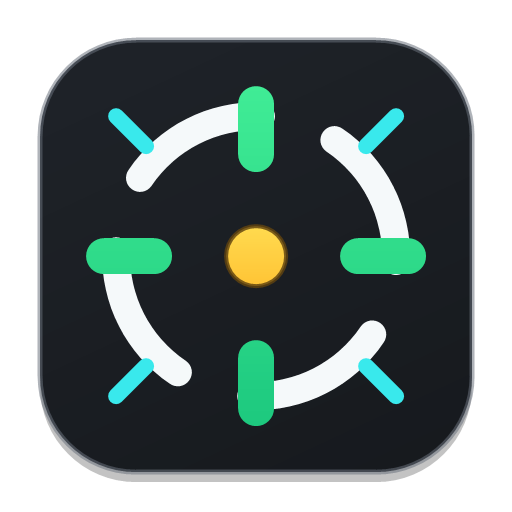

# Crosslay

  

  <a href="#ru">Русский</a> · <a href="#en">English</a>

  

## Русский

**Crosslay** - аккуратный оверлей прицела для Windows. Он помогает быстро настроить удобный прицел поверх экрана: от простого крестика до профилей с точкой, обводкой, цветом, прозрачностью и изображением.

Приложение работает как обычное прозрачное окно поверх экрана. Crosslay не внедряется в игры, не читает память процессов, не использует хуки рендера и не автоматизирует ввод.

### Скачать

  

Скачайте установщик, запустите его и следуйте шагам установки. После запуска Crosslay появится в трее: двойной клик открывает редактор, правый клик открывает меню.

### Что умеет

- Настраиваемый прицел: длина, зазор, толщина, цвет, прозрачность, точка и обводка.
- Несколько профилей для разных игр, мониторов или настроений.
- Быстрое включение и выключение прицела из трея или горячей клавишей.
- Выбор монитора, если у вас несколько экранов.
- Импорт PNG/JPG как отдельного слоя прицела.
- Проверка обновлений с понятным описанием изменений.

### Горячие клавиши

- `Ctrl+Alt+X` - показать или скрыть прицел.
- `Ctrl+Alt+Left/Right` - предыдущий или следующий профиль.
- `Ctrl+Alt+Up/Down` - изменить прозрачность.
- `Ctrl+Alt+PageUp/PageDown` - изменить размер.

## English

**Crosslay** is a clean Windows crosshair overlay. It helps you set up a comfortable on-screen crosshair, from a simple cross to profiles with a dot, outline, color, opacity, and image layer.

The app works as a normal transparent always-on-top window. Crosslay does not inject into games, read process memory, use render hooks, or automate input.

### Download

  

Download the installer, run it, and follow the setup steps. After launch, Crosslay lives in the tray: double-click opens the editor, right-click opens the menu.

### What It Does

- Custom crosshair controls: length, gap, thickness, color, opacity, dot, and outline.
- Multiple profiles for different games, monitors, or preferences.
- Quick show/hide from the tray or with a hotkey.
- Monitor selection for multi-display setups.
- PNG/JPG import as a separate crosshair layer.
- Update checks with readable release notes.

### Hotkeys

- `Ctrl+Alt+X` - show or hide the overlay.
- `Ctrl+Alt+Left/Right` - previous or next profile.
- `Ctrl+Alt+Up/Down` - adjust opacity.
- `Ctrl+Alt+PageUp/PageDown` - adjust size.
